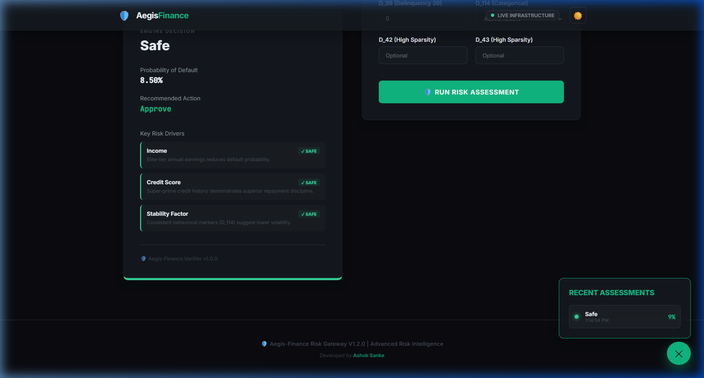
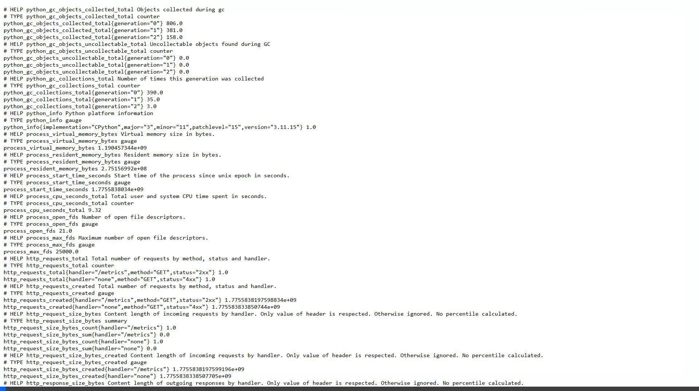
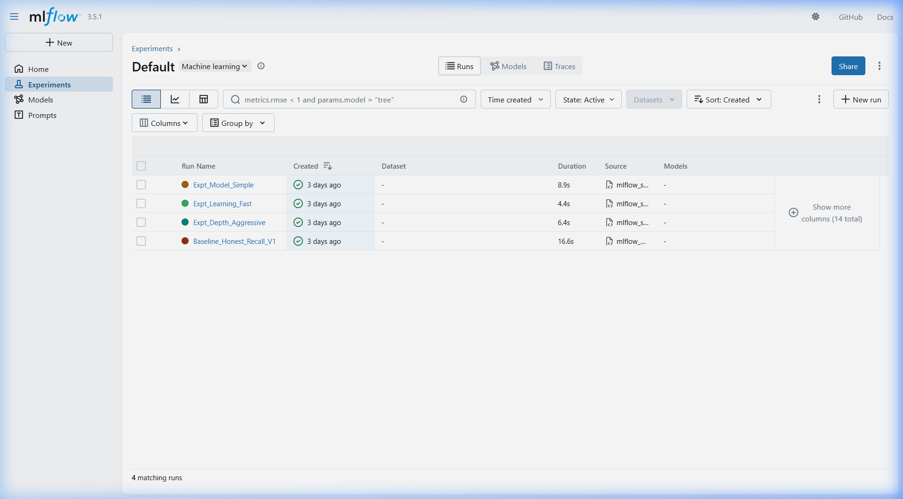
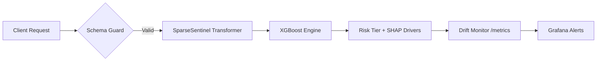

# 🛡️ Project Aegis-Finance

<div align="center">


**Production-grade loan risk assessment with XGBoost, FastAPI, and automated MLOps monitoring.**

*Real-time risk tiering and drift monitoring served via a unified Vite-React + FastAPI production ecosystem.*

🔗 **[Live Production Dashboard](https://aegis-finance-api-yryvmgxkoq-uc.a.run.app)**

</div>

---

## 🎬 System Showreel

<div align="center">
  <p><b>Premium Risk Dashboard ("Obsidian Emerald")</b></p>
  
</div>

<br/>

<div align="center">
  <table border="0">
    <tr>
      <td align="center"><b>Operational Monitoring (Grafana)</b></td>
      <td align="center"><b>Lineage & Tracking (DagsHub)</b></td>
    </tr>
    <tr>
      <td></td>
      <td></td>
    </tr>
  </table>
</div>

---

## 📋 Project Philosophy

**Aegis-Finance** is more than an inference API; it is a full-lifecycle MLOps ecosystem. Built to financial-grade standards, the project demonstrates how to bridge the gap between a raw model and a production-ready reliable service.

- 🎨 **Premium UI**: Dual-theme React dashboard with animated risk gauges and feature contribution drivers.
- ⚡ **Unified Gateway**: Single-container architecture serving both UI, API, and Prometheus sidecars.
- 🧪 **Observability First**: Built-in PSI (Population Stability Index) drift engine and real-time SLA tracking.
- ✅ **Automated Hardening**: 3-stage GitHub Actions → GAR → Cloud Run pipeline with 17-test Quality Gate.

---

## 🏗️ Architecture & Lifecycle

### Professional MLOps Stack
| Layer | technology |
|---|---|
| **Inference Engine** | XGBoost 2.1.4 + Scikit-Learn 1.6.1 |
| **Observability** | Prometheus (Metrics) + Grafana (Dashboard) |
| **Gateway** | FastAPI 0.115 + Uvicorn (Inference + Static UI) |
| **Logic** | Custom PSI Drift Monitor + SparseSentinel Transformers |
| **Tracking** | MLflow → DagsHub |
| **Deployment** | Docker (Multi-stage) → Cloud Run |

### Data Flow Logic


---

## 📊 Model Integrity & The Versioning Story

Professional model governance requires honesty about data quality. Aegis-Finance maintains a clear lineage between early research and production stability:

| Version | Status | Recall | Narrative |
|---|---|---|---|
| **v0.1** | 🛑 Retired | 99.9% | **Leakage Found**: Determinisic injected extremes identified during internal audit. |
| **v1.0** | ✅ Active | **63.1%** | **Honest Baseline**: Leakage-free probabilistic log-odds generator. |

> [!NOTE]
> **Integrity Guarantee:** The V1.0 model was recalibrated to prioritize **System Integrity** over "vanity metrics." By auditing the structural data leak in the v0.1 prototype, we established a reliability-first baseline suitable for financial risk scoring.

---

## 📡 Live Monitoring & Drift Detection

The project features a custom-built **PSI (Population Stability Index)** engine that monitors real-time traffic for distribution shifts.

### 🕵️‍♂️ Key Performance Indicators (KPIs)
- **Feature Drift**: Tracks shifts in Income and Credit Score distributions.
- **Latency SLA**: Strict **<500ms** inference gate (currently averaging ~12ms).
- **Error Rates**: Real-time tracking of 4xx/5xx responses via Prometheus.

### Access Monitoring
- **Prometheus Metrics**: `http://localhost:8000/metrics`
- **Drift Intelligence**: `http://localhost:8000/drift` (Live PSI Report)
- **Central Dashboard**: `http://localhost:3000` (Grafana)

---

## 🚀 Quick Start

### 📦 Option A: Full Observability Stack (Docker)
This starts the API, Prometheus, and Grafana in a unified ecosystem.
```bash
git clone https://github.com/sankeashok/Aegis-Finance.git
cd Aegis-Finance
docker-compose up -d --build
```
*Access Grafana at `localhost:3000` (User: `admin`, Pass: `aegis123`).*

### 🐍 Option B: Minimal API (Python)
```bash
pip install -r requirements.txt
uvicorn app.main:app --host 0.0.0.0 --port 8000
```

---

## 🔬 Engineering Quality Gate

We maintain a rigorous **17-test suite** covering the full application lifecycle.

```bash
# Run the complete hardening suite
pytest tests/ -v
```

| Suite | Coverage |
|---|---|
| **API Integrity** | Schema validation, Pydantic guards, and 422 error handling. |
| **Risk Engine** | Logic verification for Safe vs High Risk applicants. |
| **MLOps Drift** | PSI calculation stability and threshold monitoring. |
| **Performance** | Latency SLA gates and model artifact loading. |

---

## 🛠️ Project Structure

```
Aegis-Finance/
├── app/                  # FastAPI + PSI Drift Engine
├── monitoring/           # Prometheus & Grafana Provisioning
├── models/               # XGBoost + Sklearn Artifacts
├── docs/assets/          # Product visual showreel
├── tests/                # 17-test Quality Gate suite
├── Dockerfile            # Multi-stage production build
└── docker-compose.yml    # Unified MLOps stack orchestration
```

---

## 🌱 Sustainable Engineering

By parallelizing batch inference requests via `httpx.AsyncClient`, Aegis-Finance reduces the total active-compute window by **~81%** compared to sequential processing — minimizing idle CPU cycles and energy consumption per individual inference.

---

*"Security is not a feature; it is an architectural foundation." – The Engineering Council.*
